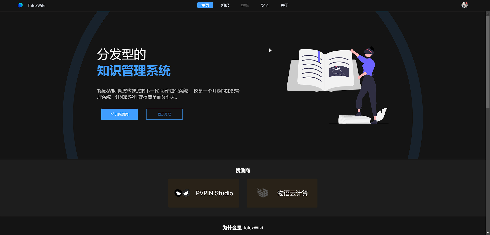

# TalexWiki 系统

> 您的下一代 协作知识系统， 这是一个开源的知识管理系统，让知识管理变得简单而又强大。

## 预览

#### 在线预览

地址: [HERE](http://test.pvpin.net)

#### 图片预览



## 食用方法

``` shell
$ pnpm install
$ pnpm run dev
$ pnpm run build (构建部署）
```

## 技术栈

- Vue3 + TypeScript (Vite)
- ElementPlus
- @tiptap + prosemirror
- pinia
- sass

## 项目背景

一直苦于没有一个好的、支持强大客制化的维基系统，于是自己动手写了一个，目前还在开发中，欢迎提出宝贵意见。

## 优势

- 干净：界面简洁，采用 TDesignS 设计（FlatUI风格），让你专注于内容。
- 强大：采用 ProseMirror + Tiptap 编辑器打造，支持 Markdown 语法，支持自定义扩展。
- 协同：支持多人协同编辑，支持多人同时编辑同一篇文章。
- 客制化：支持自定义主题，支持自定义扩展。（开发中）
- 简单：支持一键部署，支持一键导出。（一键导出开发中）
- 开源：基于 Apache License 2.0 协议开源，欢迎贡献代码。
- 适配：支持 PC、平板、手机等设备。（即将支持手表端）
- 其他：支持自定义导航栏，支持自定义侧边栏，支持自定义页面，支持自定义模板，支持自定义样式，支持自定义脚本。（开发中）

## 项目定位

支持强大客制化的同时保持九分简洁。

## 功能

🌟 亮点 🧪 试验 🍕画饼

- 维基
   - 浏览维基
   - 🌟 编辑维基
   - 🍕 协同编辑维基
   - 🧪 搜索维基
   - 🍕 一键导出维基
   - 🧪 维基概览
- 组织
   - 🧪 浏览组织
   - 编辑组织
   - 🌟 邀请成员
- 站内信
   - 🌟 系统消息
   - 🌟 应用申请
   - 🍕 互动相关
   - 🍕 反馈建议
- 用户
   - 登录 / 注册
   - 🧪 拖拽验证码系统
   - 🌟 登录历史 + ip归属
   - 🌟 个人偏好多端同步
   - 修改头像/密码
   - 邮箱验证码
- 系统
   - 🌟 多种外观风格
   - 🌟 强大的用户管理
   - 🌟 强大的权限管理
   - 🌟 日志管理

整体项目持续时间到 22/12/16 约 4个月半，因为大部分组件都是重写的 **components/** 所以风格表现大部分一致

## 你可以学到什么？

- 各个模块设计
- 组件库内的组件设计
- 优秀的 FlatUI 风格
- 丝滑流畅的动效
- 不同设备间的适配
- 常用库封装思路
- TypeScript 奇淫技巧

## Contributors ✨

Thanks goes to these wonderful people ([emoji key](https://allcontributors.org/docs/en/emoji-key)):

<!-- ALL-CONTRIBUTORS-LIST:START - Do not remove or modify this section -->

<table>
  <tr>
    <td align="center"><a href="https://github.com/TalexDreamSoul"><br /><sub><b>TalexDreamSoul</b></sub></a></td>
    <td align="center"><a href="https://github.com/shakespearesnow"><br /><sub><b>shakespearesnow</b></sub></a></td>
    <td align="center"><a href="https://github.com/zhuhaonan0137"><br /><sub><b>zhuhaonan0137</b></sub></a></td>
    <td align="center"><a href="https://github.com/Zka-96"><br /><sub><b>Zka-96</b></sub></a></td>
  </tr>
</table>

<!-- ALL-CONTRIBUTORS-LIST:END -->

This project follows the [all-contributors](https://github.com/all-contributors/all-contributors) specification.
Contributions of any kind welcome!
